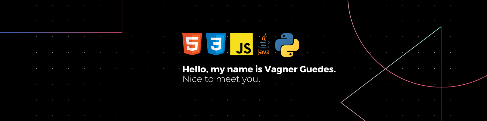

<h3 align="justify">Systems Analysis and Development student passionate about technology. I'm currently studying Systems Analysis at UCSAL and also working as an intern at In9mídia, where I have the opportunity to apply my knowledge to real projects. My main focus is on HTML, CSS, and JavaScript, and I'm also making progress in learning Java. Recently, I have started studying Python as well. I'm always seeking new experiences to improve my technical skills and expand my knowledge in software development.</h3>

  <h3>Languages and Tools:</h3>
  

    
    
    
    
    
  

  <h3>GitHub Streak and Stats</h3>
  

    
    
  

  

<h3 align="center">Connect with me:</h3>

  
  
   

