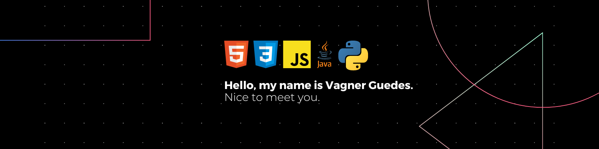

# Olá, eu sou Vagner Guedes

### Analista de Sistemas e desenvolvedor apaixonado por tecnologia

  Desenvolvo soluções web com foco em interfaces intuitivas, sistemas eficientes
  e experiências que resolvem problemas reais.

  Atualmente, estou aprimorando meus conhecimentos em desenvolvimento
  Full Stack, arquitetura de sistemas e boas práticas de software.

---

## Sobre mim

- Formado em **Análise e Desenvolvimento de Sistemas**
- Experiência com suporte, análise de sistemas e desenvolvimento de software
- Interesse em aplicações web, automação e produtos digitais
- Sempre aprendendo novas tecnologias e aprimorando meus projetos
- Buscando transformar necessidades reais em soluções simples e funcionais

---

## Tecnologias e ferramentas

### Front-end

### Back-end

### Banco de dados

### Ferramentas

---

## Contribuições

<picture>
  <source
    media="(prefers-color-scheme: dark)"
    srcset="https://raw.githubusercontent.com/Vagner-Guedes/Vagner-Guedes/output/github-contribution-grid-snake-dark.svg"
  />

  <source
    media="(prefers-color-scheme: light)"
    srcset="https://raw.githubusercontent.com/Vagner-Guedes/Vagner-Guedes/output/github-contribution-grid-snake.svg"
  />

  
</picture>

---

## Entre em contato

---

### Obrigado por visitar meu perfil

Explore meus repositórios para conhecer os projetos e estudos que estou desenvolvendo.

